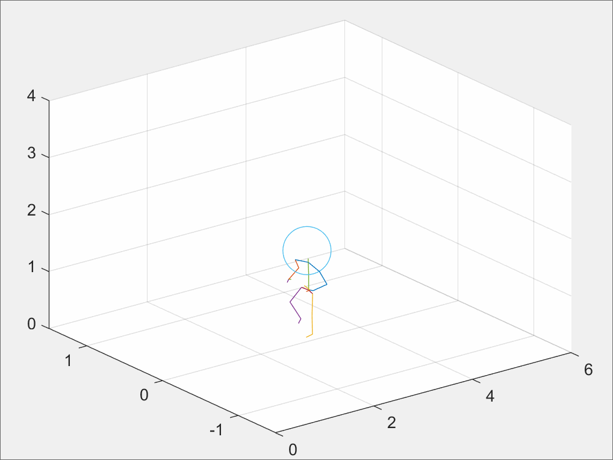
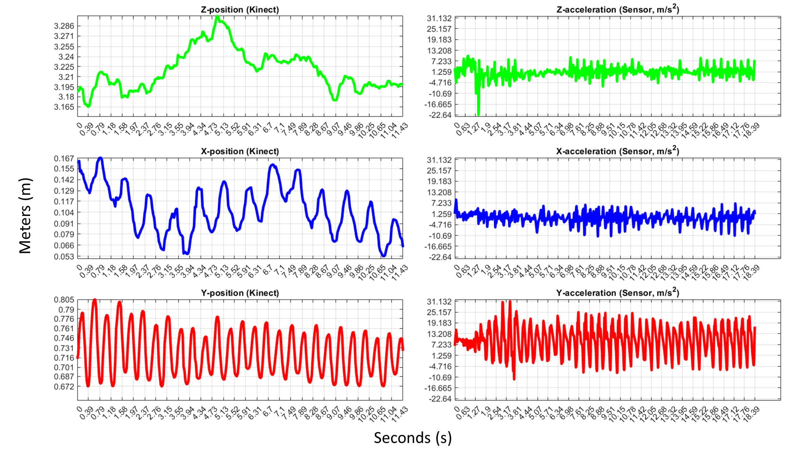
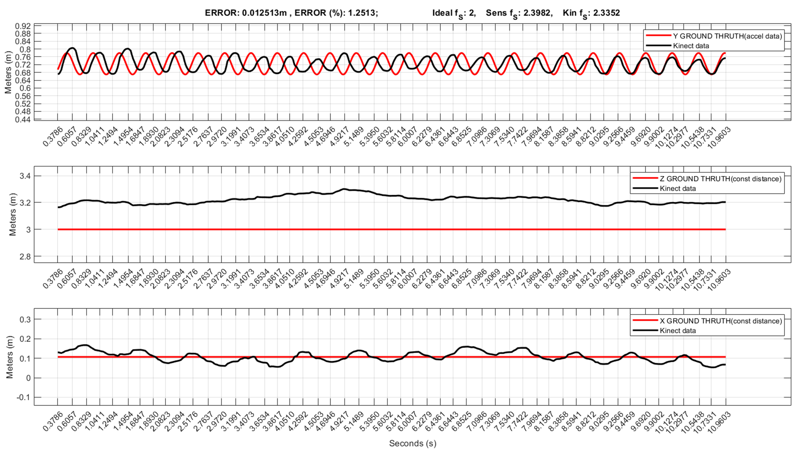

# Advancing 3D Kinematics: Precision Assessment of Kinect v2 and IMU in Motion Capture

## Introduction
This project delves into the analysis of 3D body motion, leveraging the capabilities of Kinect V2 and Inertial Measurement Units (IMUs). We aim to assess the accuracy and synchronization of data captured by Kinect technology with respect to IMU data (collected using a Samsung A51 mobile phone) during physical activities, with a specific focus on the 'skip' motion. Our analysis seeks to bridge the gap between Kinect's optical tracking and IMU's acceleration measurements.

### Authors
- Gabriele Santicchi <gabriele@santicchi.it>
- Antonia Lopreside <antonia.lopreside@mail.polimi.it>
- Davide Matichecchia <davide.matichecchia@mail.polimi.it>

## Getting Started
Before proceeding with the analysis, ensure that:
- MATLAB (version R2021b or newer) is installed.
- The Kinect V2 sensor and MATLAB Mobile App for IMU data acquisition are set up.

## Repository Structure
- `REAM_IMU.md`: Instructions for acquiring data using the MATLAB Mobile App.
- `REAM_KINECT.md`: Instructions for acquiring data using the Kinect V2 System.
- `main_kinect_acquisition.m`: Script for acquiring data from Kinect V2.
- `main_processing.m`: Main analysis script.
- `main_plotting.m`: Script for plotting joint positions.
- Additional supporting scripts and data files.

## Workflow
1. **Data Acquisition:**
   - **Kinect V2:** Use `main_kinect_acquisition.m` to capture motion data. Customize frame rate and capture duration as needed.
   - **IMU:** Follow `REAM_IMU.md` for instructions on using the MATLAB Mobile App for IMU data capture.
2. **Data Processing and Analysis:**
   - Run `main_processing.m` with necessary data files. This script integrates Kinect and IMU data, focusing on their synchronization and accuracy assessment.
   - Fine-tune hyperparameters within the script for specific analysis needs.
3. **Visualization and Further Analysis:**
   - Utilize `main_plotting.m` to delve into the nuances of joint movements. This script aids in understanding the dynamics of the 'skip' motion through visual representations.

For detailed instructions on each step, refer to the respective documentation files in this repository.

#### Visual Representations:
Below are visual representations from our tests:

  
  

- The GIF illustrates the joint displacement during a periodic skip excercise, recorded by Kinect v2. The steps frequency was monitored using a Metronome app on a smartphone.
- The image depicts the distance displacement reported by Kinect system on the 3 axis (on the left), and the 3-axis acceleration logged by the IMU sensor.

#### Key Findings:
- The average error in terms of joint positions was found to be within **2-8%**.
- The error margin in measuring the amplitude of movements was between **1-2%**.
- Frequency measurements showed an error range of **2-3%**.
 

These results indicate that while Kinect can be utilized for scenarios where high precision is not paramount, it's advisable to complement it with an IMU sensor for improved data acquisition, especially in frequency analysis.

## Contributing
Contributions to this project are welcome. Please read `CONTRIBUTING.md` for more information on how to contribute.

## License
This project is licensed under the MIT License - see the `LICENSE` file for details.

